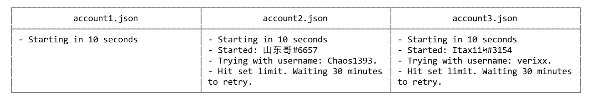

# 6s [](https://badge.fury.io/js/6s)

6s (success */səkˈses/*) is a small CLI script that will change the username of Discord accounts in hopes of forcing a specific discriminator.



## Install

```
$ npm install -g 6s
```
## Usage

You can't currently change the list of discriminators to look for. Coming soon™.

```
$ 6s [<files> ...]
```

## Disclaimer

There is a **strong** chance that Discord will ban your account for using this tool. I'd recommend buying [Discord Nitro](https://discordapp.com/nitro) if you want your preferred discriminator. That being said, there's nothing against me programming a tool like this. <sup>I think <sup>(hope)</sup></sup>

#

<p align="center">
  <a href="http://paco.sh"></a>
</p>
